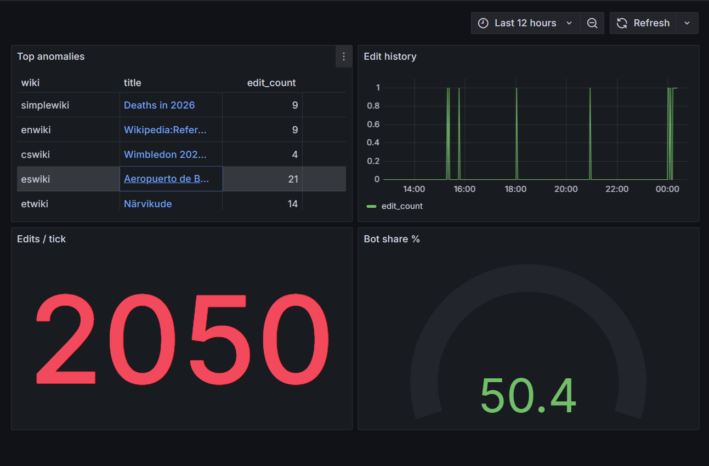
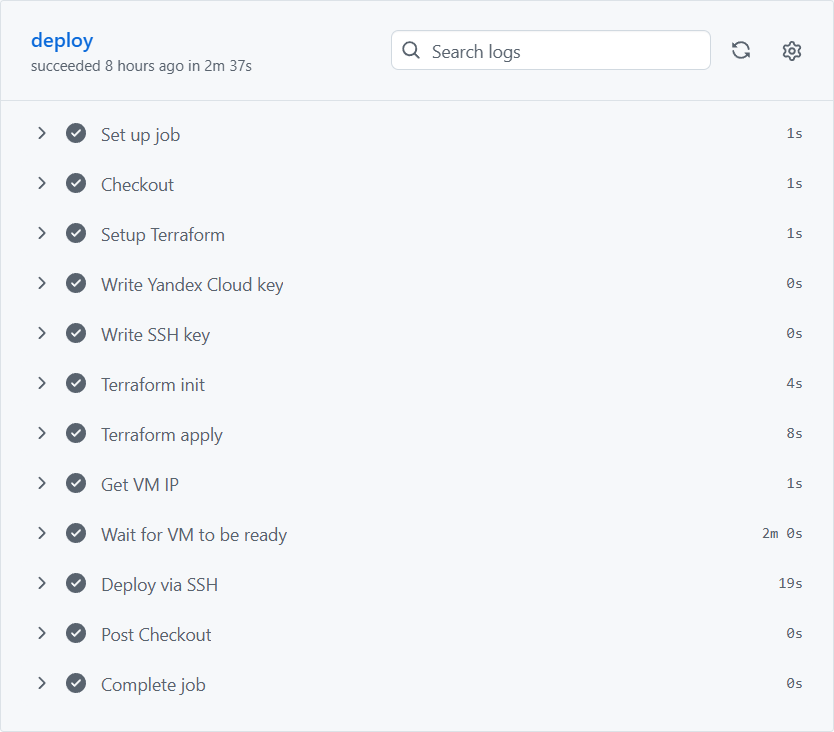

# wiki-edit-monitor

A streaming anomaly detection pipeline for Wikimedia edits. Consumes the public [Wikimedia EventStreams](https://wikitech.wikimedia.org/wiki/Event_Platform/EventStreams) feed in real time, aggregates edit activity per page into ClickHouse, and surfaces statistical anomalies on a Grafana dashboard — a real-time view of statistically unusual edit bursts across all Wikimedia projects.



## Architecture

Wikimedia publishes a continuous SSE stream of all edits across its projects. A Python consumer reads this stream, groups events into 2-minute buckets by event time, and flushes aggregated counters to ClickHouse. A Grafana dashboard runs z-score queries directly against ClickHouse to surface pages whose edit rate is anomalously high relative to their own history.

The anomaly score is a z-score relative to each page's own edit history: `(edit_count - mean) / stddev` over past hourly windows. Pages with fewer than 10 historical observations are excluded to avoid false positives on rarely-edited articles.

## Stack

**Python / aiohttp** — SSE consumer, tick aggregation, automatic reconnect on stream drop

**ClickHouse** — time-series storage with z-score computed via window functions; column-oriented storage fits append-only aggregates well, though Postgres would handle this volume too

**Grafana** — dashboard and alert rules provisioned as code via Helm values

**Altinity operator** — industry-standard pattern for running ClickHouse on Kubernetes

**k3s + Helm + helmfile** — single-node Kubernetes; one `helmfile sync` deploys the full stack in dependency order

**Terraform** — VM provisioning and k3s bootstrap on Yandex Cloud, remote state in Object Storage

**GitHub Actions** — deploy triggered manually via `workflow_dispatch`

**Chaos Mesh** — pod-kill and network-partition resilience scenarios

**pytest** — unit tests for bucketing logic; run automatically in CI before deploy

**Docker Compose** — local development only, not used in production

## Local development

```bash
cp .env.template .env
# fill in TF_VAR_clickhouse_password and TF_VAR_grafana_password
docker compose up --build
```

Grafana will be available at `http://localhost:3000`.

On first run the consumer backfills 1 day of history (`BACKFILL_DAYS=1` in `docker-compose.yml`). On subsequent restarts it continues from where it left off. To backfill more history locally set `BACKFILL_DAYS` in `.env` before starting.

## Deployment

### One-time setup

1. Create a Yandex Object Storage bucket named `wiki-edit-monitor-tfstate` (private, versioning enabled).

2. Run bootstrap to create a Terraform service account:
   ```bash
   bash deploy/bootstrap.sh
   ```

3. Create a static access key for the service account in the Yandex Cloud console (IAM → Service accounts → terraform-sa → Static access keys).

4. Add the following secrets to the GitHub repository (Settings → Secrets and variables → Actions):

   | Secret | Description |
   |---|---|
   | `YC_KEY_JSON` | Contents of `deploy/terraform/key.json` |
   | `YC_FOLDER_ID` | Yandex Cloud folder ID |
   | `SSH_PRIVATE_KEY` | Private SSH key |
   | `SSH_PUBLIC_KEY` | Public SSH key |
   | `AWS_ACCESS_KEY_ID` | Object Storage static key ID |
   | `AWS_SECRET_ACCESS_KEY` | Object Storage static key secret |
   | `TF_VAR_clickhouse_password` | ClickHouse password |
   | `TF_VAR_grafana_password` | Grafana admin password |

### Running a deploy

Actions → Deploy → Run workflow.

Terraform provisions a Yandex Cloud VM, installs k3s, then deploys the full stack via `helmfile sync` over SSH. On first run the consumer backfills up to 31 days of Wikimedia edit history before switching to the live stream.



Grafana is available at `http://<VM_IP>` after the workflow completes. The IP is printed in the Terraform apply step.

## Chaos engineering

Install Chaos Mesh into the cluster:

```bash
helmfile --file chaos/helmfile.yaml sync
```

Run both scenarios:

```bash
bash chaos/run-chaos.sh
```

**pod-kill** — kills the consumer pod. Kubernetes restarts it; the consumer resumes from where it left off with no data loss beyond the current unflushed tick.

**network-partition** — cuts network between the consumer and ClickHouse. The consumer crashes on failed INSERT, enters CrashLoopBackOff, then recovers after the partition is lifted and the deployment is restarted.

Remove Chaos Mesh when done:

```bash
helmfile --file chaos/helmfile.yaml destroy
```

A few honest limitations: z-score reacts to any sharp spike and does not distinguish vandalism from a legitimate surge of interest. Edit wars are approximated as a high rate of edits to the same page — there is no explicit revert flag in the event schema. New account detection is weak as account age is not part of the event payload.